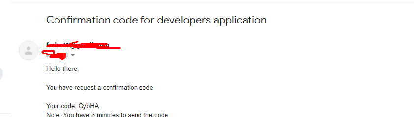

# email-verification-system by Fnr#0017

<h1 align="center"></h1>

- get started

1- First create file named "config.json"<br>2- npm install

- config.json
```
{
    "token": "Your discord bot token",
    "prefix": "Your bot prefix",
    "email": "Your email to bot logged in",
    "password": "Password for email"
}
```

**if you have any problem with code you can just dm me in discord Fnr#9999**
